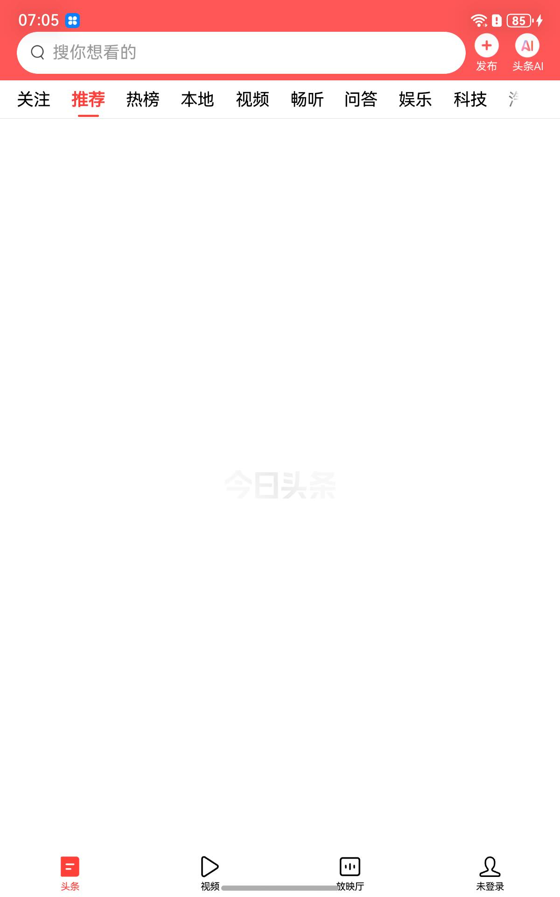
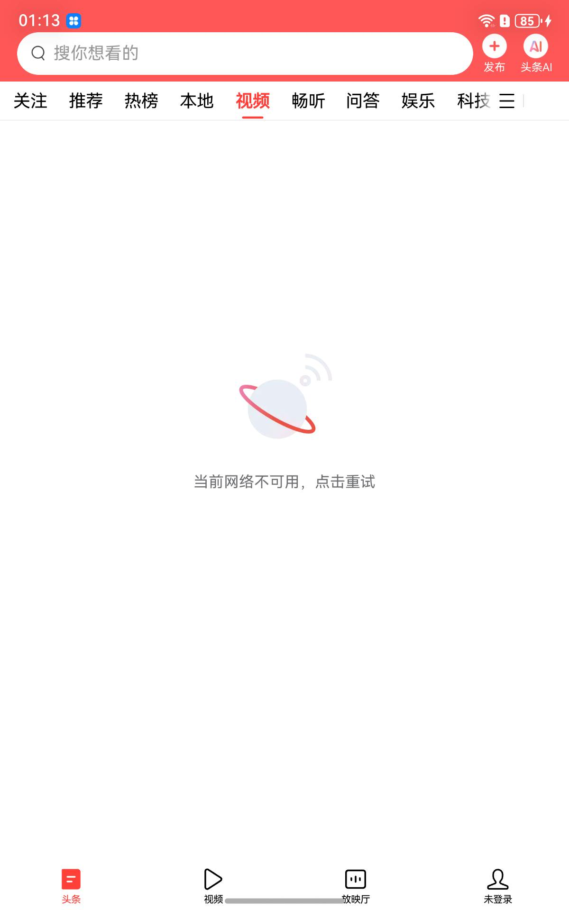
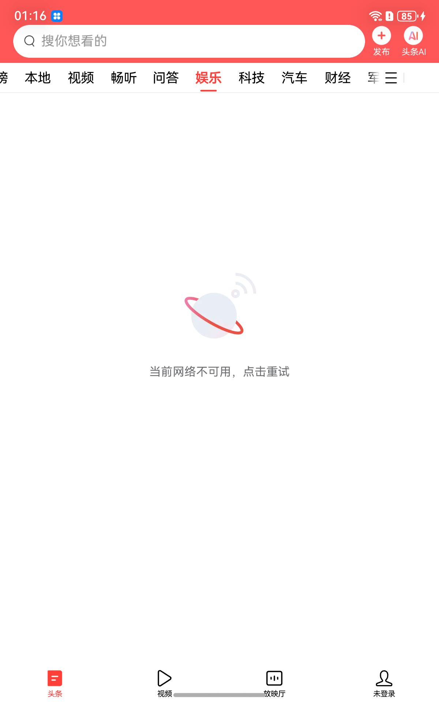
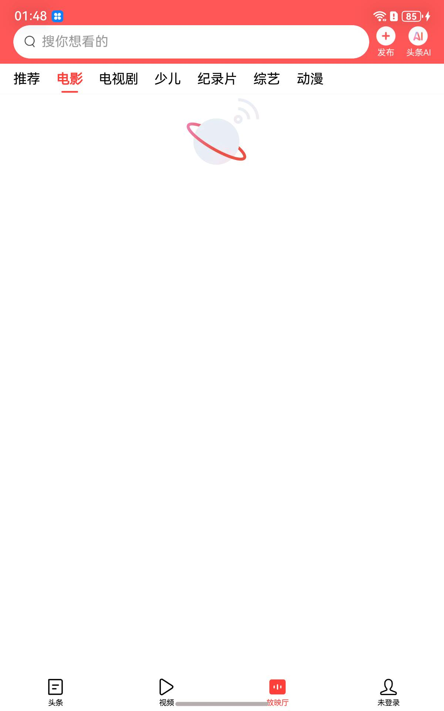
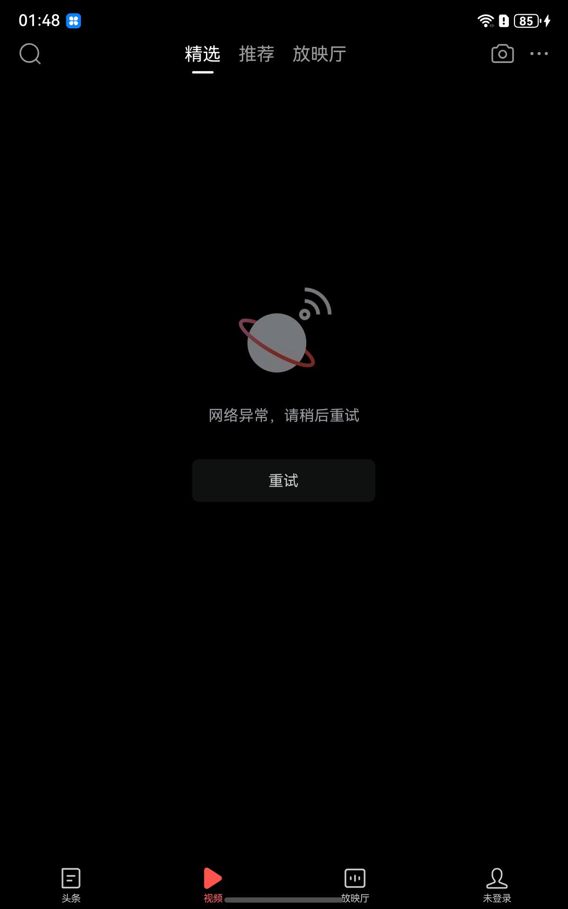
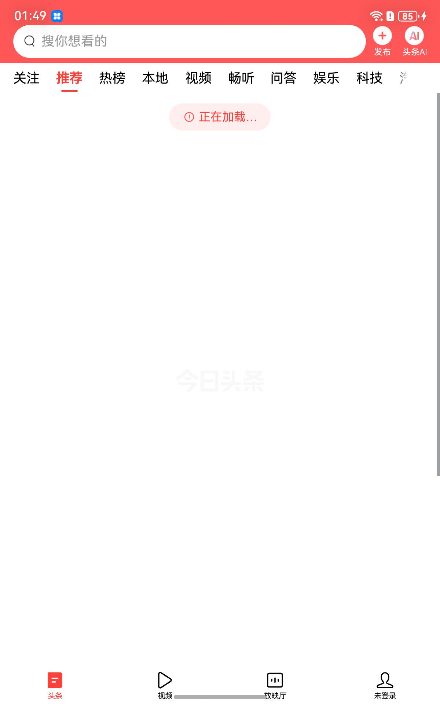
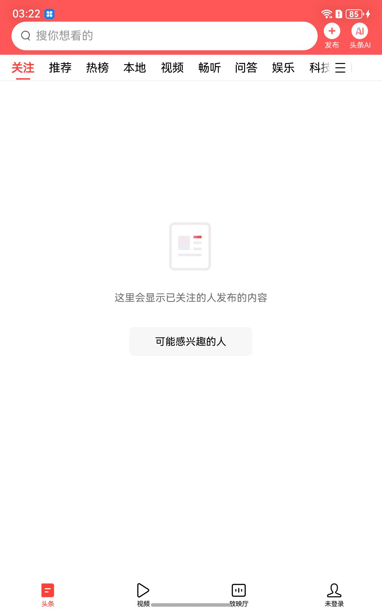
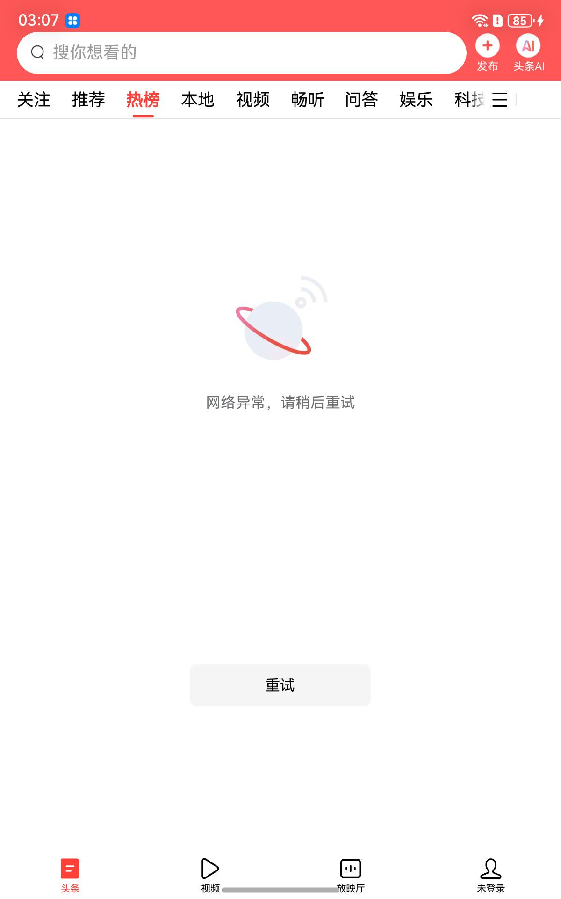
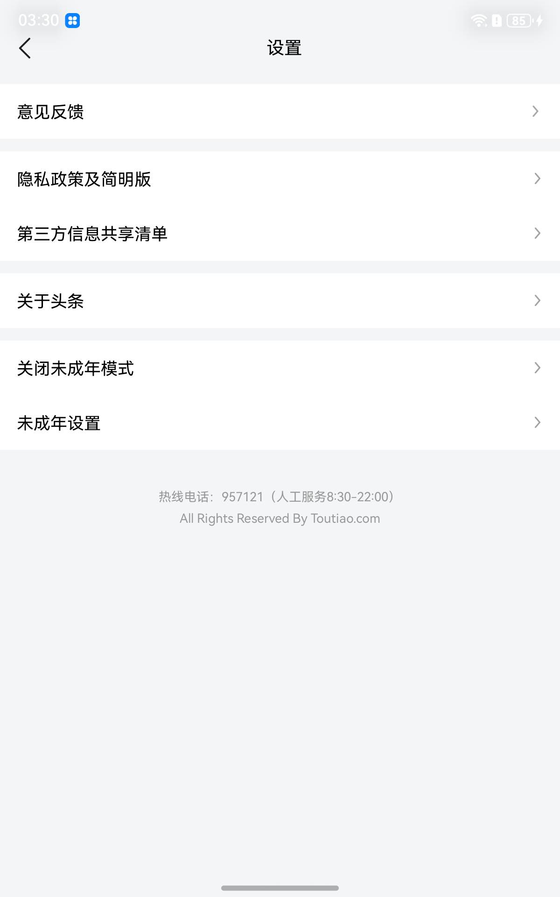

# 今日头条 · OpenHarmony 首帧复现

在 **OpenHarmony 6.1.0.31 / DAYU200 (aarch64)** 上，通过 Westlake **a2oh** Android 兼容适配层
把 **今日头条 (com.ss.android.article.news)** 跑到 `ArticleMainActivity` **首帧全彩渲染**。


顶栏搜索框、频道栏（关注 / **推荐** / 热榜 / 本地 / 视频 / 畅听 / 问答 / 娱乐 / 科技）、
底部导航（头条 / 视频 / 放映厅 / 未登录）全部渲染。

> **信息流区域为空是预期结果**，不是缺陷。适配层的 TLS 目前是
> `construct-only SSLContext`（日志原文 `TLS shim: no real networking (construct-only SSLContext on OH)`），
> 任何 HTTPS 请求都发不出去，所以拉不到文章。控件树证明布局本身完整：
> `FeedCommonRecyclerView` 已 `VISIBLE 1200x1567`，`LoadingFlashView` 正在转圈。

真实控件树见 [`frames/mainactivity/MAINACTIVITY-viewtree.txt`](frames/mainactivity/MAINACTIVITY-viewtree.txt)（120 行，进程内探针 dump）。

---

## 1. 技术原理：挡在首帧前的致命崩溃

全部修复都**不需要重烘 boot image，也没有 patch `libart.so`**。

| # | 症状 | 根因 | 修复 |
|---|---|---|---|
| 1 | `MUSL: create socket failed for family: 2, errno: 1` | OH appspawn 的 `SetInternetPermission` 按 **AccessToken** 判定（不是 GID，也不是 BPF）。适配层装包器一条 Android 权限都没映射，`permission_state_table` 为空 → 装上 seccomp 过滤器让 `socket(AF_INET)` 返回 EPERM | 直接往 `access_token.db` 补 INTERNET 授权行（`scripts/grant_internet.sh`），避免 `bm install -r` 重建 bundle 目录 |
| 2 | `NoSuchMethodError: set([F)V in ColorMatrix` → `AsyncImageView.<clinit>` 失败 → 信息流布局无法 inflate | `adapter-mainline-stubs.jar` 的 `ColorMatrix` 桩缺 `set(float[])`，而它在 BCP，加方法必须重烘 boot image | 改 **App dex**：`AsyncImageView.<clinit>` 里的 `ColorMatrixColorFilter` 置 null（该字段只是夜间灰度滤镜） |
| 3 | `NullPointerException: No platform found on Android` → 所有 TTNet `DoConnect` 失败 | okhttp 的 `Platform` 检测两条路都要 `com.android.org.conscrypt.SSLParametersImpl`，而适配层 BCP **完全没有 conscrypt** | 关键点：它走 **Mira 的 `ClassLoaderHelper`（App 类加载器）**，不查 BCP。追加一个 `classes22.dex` 放空类即可 |
| 4 | 每 ~18s 必崩 `SIGSEGV @ 0x0`，`ICUWrapper::ICUWrapper()+100` | `libtttext_lite.so` 扫 `/system/usr/icu` 得到 OH 的 `icudt74l.dat` → 版本 74 → dlsym `ubrk_open_74`，而适配层 Android 侧 ICU 是 **72** | `libwlicu.so`：15 个符号 `b <name>_72` 裸尾跳转；等长改 tttext 的 dlopen 名 |
| 5 | 每 ~25s 必崩，`libnpth.so` `__stack_chk_fail` | NPTH 注册 bionic 形状的 fdsan 回调，musl `close()` → `fdsan_close_with_tag` 调用时栈约定不符 | 从 apk 里**删掉** `lib/arm64-v8a/libnpth.so`（改名无效：`app_librarian` 每次启动从 apk 重新解包） |
| 6 | `IllegalArgumentException: appName is empty` 打死主线程 | AppLog `BdInstallImpl.init` 校验 appName 非空 | NOP 掉 `X/4Li.a()` 里的 `if-nez`（TLS 是桩，分析上报本来也发不出去） |
| 7 | `NoSuchFieldError` → `PrivateApiLancetImpl.<clinit>` | 该 `<clinit>` 连读 **8 个** `MediaStore.*_CONTENT_URI`，桩里一个都没有 | 入口改 `return-void` |
| 8 | `UnsatisfiedLinkError: AudioPortEventHandler.native_setup` | `HeadsetHelperOpt.p()` → `AudioManager.getDevices()` 依赖未实现的 framework JNI | 入口改 `return-void`（板子没有耳机） |
| 9 | `ArticleMainActivity.delayInit()` 上还有一串同类地雷 | `onWaitFeedTimeout → delayInit` 会连续踩适配层空缺 | 入口改 `return-void` |
| 10 | `ASSERT FAILED [skia] mEglSurface == EGL_NO_SURFACE` → `abort() hwui hijack` → **exit 134** | PopupWindow (`TYPE_APPLICATION_PANEL`) 在适配层拿不到 OH scene session，退化到 `session=1`（无 surface、无输入）。它 relayout 时把 **MainActivity 自己窗口的 surface** 也拆了 | 见下 |
| 11 | `IllegalStateException: Surface was not locked` → **exit 1** | 关掉硬件渲染后退到 `drawSoftware()`，而那个 Surface 没有 buffer producer，`lockCanvas()` 从未真正上锁 | 见下 |

### 第 10/11 项的收敛：子窗口注册表 + 释放 `mSurface`

在 `ActivityManagerRouting`（代理 `IWindowSession`）里对子窗口彻底静默绘制。有两个坑：

**坑一：`attrs == null`。** `ViewRootImpl.relayoutWindow()` 只在 LayoutParams *变化时*才传 attrs，
之后每次 relayout 都传 `null`。所以按当次 `attrs.type` 判断会漏掉第 2..N 次 —— 第一次拦下了，
第二次放行，适配层返回 `SURFACE_CHANGED(2)`，ViewRootImpl 重绘，主线程当场崩。
解法是**子窗口注册表**（弱键，popup 消失后不钉住 ViewRootImpl）：

```java
sSubWindows = Collections.synchronizedSet(newSetFromMap(new WeakHashMap<>()));

subWindowType(window, attrs):
    attrs != null && type >= 1000                                  -> 登记并返回
    sSubWindows.contains(window)                                   -> 命中（attrs==null 也认得）
    window.mViewAncestor -> ViewRootImpl.mWindowAttributes.type     -> 兜底探测
```

**坑二：`setWindowStopped(true)` 挡不住已经排上的 traversal。**
但 AOSP `ViewRootImpl.draw()` 开头恒有 `if (!surface.isValid()) return false;` ——
所以**在真实调用之后**反射释放 `ViewRootImpl.mSurface`，绘制就在 lock/unlock 之前被短路。
必须放在调用之后，否则适配层会把 Surface 换回来。

效果：

| | 修复前 | 修复后 |
|---|---|---|
| 子窗口拦截次数 | 2（只有带 attrs 的两次） | **13** |
| `ASSERT ... EGL_NO_SURFACE` → exit 134 | 每次 | **0** |
| `Surface was not locked` → exit 1 | 每次 | **0** |
| 进程存活 | 60–80s 必死 | **180s 全程存活** |
| 截图 | 38 KB 纯白 | **71–72 KB 主界面** |

---

## 2. 环境要求

| 项 | 值 |
|---|---|
| 板子 | DAYU200 (RK3568 类)，aarch64 |
| 系统 | OpenHarmony **6.1.0.31**（架构冻结，不要升级） |
| 适配层 | Westlake a2oh，`appspawn-x` ondemand + sealed child plugin，route-a generation `74e6f759…8ce16d` |
| 挂载 | `pr03-74e6-portable` 7 个 bind mount 必须 `state=READY`（`sh /data/pr03-74e6-portable/runtime/pr03-runtime-recover.sh`） |
| ART | 强制解释执行：`APPSPAWNX_FORCE_INT=1` / `APPSPAWNX_NO_JIT=1`。**不要关**——本适配层的 JIT 会在 `JitCompiler::ParseCompilerOptions` 空指针崩溃 |
| 主机 | `hdc` 能连到板子；源码构建另需 JDK 11+、`d8`、OpenHarmony native SDK |

> 板子需要联网（首帧本身不依赖网络，但便于对照）；WiFi 连上后 NTP 会把时钟拨正，
> 这块板子没有 RTC。

---

---

## 3. 真实真机界面验收矩阵

板端 1200x1920，`base.final7.apk` + TLS 桥接，2026-09-05 实测采样。
**如实记录**：只有首页是真正验收通过的，交互类采样全部失败，原因见下。

| # | 界面 | 采样方式 | 结果 | 凭据 |
|---|---|---|---|---|
| 1 | 首页 · 推荐 Feed | 冷启动 `aa start MainActivity` | ✅ **真实渲染** |  |
| 2 | 顶部 9 个频道 Tab<br>关注/推荐/热榜/本地/视频/畅听/问答/娱乐/科技 | `uinput -T -c <x> 213` | ❌ **点击无响应** | 同上一张：点完「科技」后仍停在「推荐」（红下划线未移动） |
| 3 | 底部 4 个导航<br>头条/视频/放映厅/未登录 | `uinput -T -c <x> 1855` | ❌ **点击无响应** |  点完「未登录」后仍高亮「头条」 |
| 4 | 顶部搜索框 | `uinput -T -c 400 112` | ❌ **点击无响应** |  |
| 5 | `SearchActivity` | `aa start` | ❌ **启动即崩**（此前误记为"能拉起、未上屏"）|  白屏 |
| 6 | `NewDetailActivity` | `aa start` | ❌ 同上 |  白屏 |

> **更正**：第 5、6 项不是"渲染不出来"，是 `performLaunchActivity` 当场抛
> `IllegalStateException: You need to use a Theme.AppCompat theme`、**进程直接死**。
> 根因是 `ActivityInfo.theme` 恒为 0（适配层的 manifest parser 不带 theme），
> 详见 [`docs/INPUT_PATH_ANALYSIS.md`](docs/INPUT_PATH_ANALYSIS.md) 第 10 节。

### 为什么交互采样全部失败

**触控事件根本没有送达 App。** 逐像素比对证实：点击底部导航/搜索框后的帧，
与基线在状态栏以下只有 **7563 / 2136000 ≈ 0.35%** 的像素差异，
且集中在时钟与「视频」进度条动画上——**没有任何界面切换**。

适配层**创建了**输入通道：

```
[OH_WSA] step3a createInputChannelPair OK
[OH_WSA] step3b InputChannel.copyTo OK
```

但 OH 的 multimodal input 从未把 pointer 事件投递进去。这与之前定位的
PopupWindow「无 surface、无输入」是同一类问题（见 `docs/ROOT-CAUSES.md` 第 10 项），
只是范围更大：**主窗口同样收不到输入**。

> 这也修正了此前的一个推断：先前认为隐私弹窗是被我们点掉的。既然触控从未送达，
> 该弹窗更可能是被 `PrivateApiLancetImpl.<clinit>` 或其它补丁改变了触发条件，
> **不是**被点击接受的。

**根因已定位**，见 **[`docs/INPUT_PATH_ANALYSIS.md`](docs/INPUT_PATH_ANALYSIS.md)**：
适配层只造了输入链路的消费端，生产端整段不存在——
`nativeRegisterInputChannel` 因为 `InputChannel` 没有 `getFd()` 而静默 no-op、
`OHInputBridge::subscribeMmi()` 是一条 `ret`、监听线程拿到数据也只打日志、
整个适配层从 `libmmi-client` 只导入设备枚举 API。
「通道建好了」这条日志只对了一半：AOSP 侧的 socketpair 确实建好了，
适配层侧的登记从未发生。

消费端是完整的，所以我们从消费端重新接入（见 `amr/`，产物
`oh-adapter-runtime.all.jar`）：

```bash
scripts/wl_input.sh tapv 320 213     # 或 echo 到 /data/local/tmp/wl_input.cmd
```

这让界面能被脚本驱动，但**不是 MMI 的替代品**：
真实硬件触控仍需板端实现 `subscribeMmi()`。

### `aa start` 能拉起但不上屏

`aa start` 对 972 个已声明 ability 有效（`start ability successfully`），
但每个新 Activity 都要重付一次**解释器冷渲染成本**——主界面首帧本身就要 80–110 s，
采样时给的 6 s 远远不够。要采到这些页面，需要每个 Activity 单独等 2 分钟。

### 结论：交互已打通（2026-09-05 更新）

`uinput` 那条路走不通，而且以后也走不通：硬件触控要贯通必须在适配层源码里实现
MMI 订阅（`docs/INPUT_PATH_ANALYSIS.md` 第 5 节）。但绕开它之后，**界面是可以驱动的**。

打通共需两件事：

1. **`wl-input-pump`**——从适配层输入链路唯一完整的那一半（消费端）重新接入；
2. **`libwlveltrack.so`**——补上 `android.view.VelocityTracker` 缺失的 7 个 native 方法。
   没有它，触摸一碰到任何可滚动容器就抛 `UnsatisfiedLinkError`，
   而这个异常被 ViewRootImpl 的阶段链吞掉，表现为"事件送到了但什么也没发生"。

坐标不再靠猜：`dump` 现在打的是 `getLocationOnScreen` 的**绝对**矩形与中心点
（`frames/mainactivity/MAINACTIVITY-viewtree-abs.txt`）。相对坐标在这里没用——
`SSTabHost` 的孩子因为 Gravity/Margin 大多报 `@0,0`，而底部导航的真实位置是
`TabWidget abs=[0,1821][1200,1920]`，四个 Tab 中心分别在
`x=150 / 450 / 750 / 1050，y=1870`。

| # | 界面 | 动作 | 结果 | 截图 |
|---|---|---|---|---|
| 1 | 推荐（基线）| — | ✅ |  |
| 2 | **热榜** | `tapv 320 213` | ✅ 红线移位，页面换成热榜空态 |  |
| 3 | **视频（频道）** | `tapv 560 213` | ✅ 频道行自身滚动，页面换成视频空态 |  |
| 4 | **娱乐** | `tap 840 213` | ✅ 走 ViewRootImpl 正式路径，同样成功 |  |
| 5 | **放映厅** | `tap 750 1870` | ✅ 频道行整排换成 推荐/电影/电视剧/少儿/纪录片/综艺/动漫 |  |
| 6 | **视频（底部大屏）** | `tap 450 1870` | ✅ **整页深色主题**，子频道换成 精选/推荐/放映厅，像素差 **99.76%** |  |
| 7 | **下拉刷新** | `swipe 600 500 600 1300 500` | ✅ 顶部露出「⊙ 正在加载…」刷新条 |  |
| 8 | 未登录 / 我的 | `tap 1050 1870` | ❌ 无变化（见下） | — |
| 9 | 顶部搜索框 | `tap 517 113` | ❌ 无变化（见下） | — |

### 2026-09-06：真实新闻流上屏

S2 打通 SQLite + TLS 后，`ActivityManagerRouting` 合流为单一 jar（输入泵 + 窗口按秩选 +
VelocityTracker + Theme 兜底 + SQLite shim + TLS 网关 + ALooper），四套日志同时在跑：

```
[WL-INPUT] pump armed …        [WL-VELTRACK] self-test OK …
[WL-SQLITE] JNI_OnLoad: CursorWindow=OK SQLiteConnection=OK
[WL-THEME] parsed …/base.apk: 780 activity themes, application theme=0x7f0900…
```

| # | 界面 | 结果 | 截图 |
|---|---|---|---|
| 10 | **推荐 · 真实信息流** | ✅ **182 KB**（空页时只有 71 KB）：置顶 3 条带来源与评论数、环球网 1142 赞、人民网 1024 赞、图文卡片带真实配图 |  |
| 11 | 关注 | ⚠️ 切换成功，内容空态 |  |
| 12 | 热榜 | ⚠️ 切换成功，内容空态 |  |
| 13 | 本地 | ⚠️ 切换成功，内容空态 |  |
| 14 | **视频频道** | ✅ 切换成功（空态）|  |
| 15 | **搜索主界面** | ✅ 见下（第 12 号补丁）|  |
| 16 | **第二个 Activity**（设置页）| ✅ 完整渲染 |  |

> **视频 / 畅听频道有条件崩溃**：信息流**已加载真实内容**时切过去会打死进程——
> `InflateException … Error inflating class com.ss.android.article.common.PullToRefreshSSWebView`。
> 这两个频道由 WebView 承载（`android.webkit.WebView` 类在 framework.jar 里**是有的**，
> 挂在更深处，未定位）。信息流为空时切过去只渲染空态，不崩。

**只有推荐频道有真实内容**，其余频道走不同接口、仍返回空态——属内容层，不是输入或渲染问题。

### Theme 兜底真机验收：**新 Activity 第一次真正上屏**

`aa start com.bytedance.bdauditbase.teenmode.impl.ui.setting.TeenSettingActivity`：

| | 修复前 | 修复后 |
|---|---|---|
| `[WL-WIN] addToDisplay` | **0**（窗口从未创建） | **1**（`type=1 BASE_APPLICATION`）|
| 进程 | `alive=0`（启动即崩） | **`alive=1` 全程存活** |
| 屏幕 | 81 KB（桌面）| **69.5 KB 完整设置页** |


返回箭头、标题「设置」、六个条目、底部「热线电话：957121」与
「All Rights Reserved By Toutiao.com」全部渲染。
**这条链路（第二个 Activity 完整拉起并上屏）到此打通。**

### `SearchActivity` 已打通（第 12 号补丁）

Theme 修好之后，搜索页推进到 `SearchFragment.onCreate`，死在**一具早就凉了的尸体**上：

```
NoClassDefFoundError: X.BdA
Caused by: ExceptionInInitializerError at com.ss.android.ad.init.PreloadTask.run
Caused by: ArrayIndexOutOfBoundsException: length=0; index=0
```

顺着 `X.BdA.<clinit>` → `c()` → `X.3CD.a()` 查下去，第一条指令就是
`X.4Yx.c()`（`Environment.getExternalStorageState()`）。AOSP 对它的实现是
`getExternalDirs()[0]` —— **这块板子没有任何外部存储卷，数组是空的**，于是抛
AIOOBE。`<clinit>` 一失败，ART 就把 `X.BdA` 永久标记为 erroneous，
之后任何人碰它都变成 `NoClassDefFoundError`。搜索页只是第一个撞上的。

`X.3CD.a()` **本身就带正确的兜底**：状态不是 `"mounted"` 时走
`Context.getCacheDir()`。所以只要别去问 Environment 就行——等宽替换 8 字节：

```
invoke-static X.4Yx.c ; move-result-object v1     71 00 20 51 00 00 0c 01
    ->  const-string v1, "" ; nop ; nop            1a 01 00 00 00 00 00 00
```

之后 `"".equals("mounted")` 为假，现成的分支把它带到 `getCacheDir()`。

| | 修复前 | 修复后 |
|---|---|---|
| `[WL-WIN] addToDisplay` | 0 | **1**（`type=1`, `adjust=pan`）|
| 进程 | `alive=0` | **`alive=1` 全程** |
| 屏幕 | 桌面 | **搜索页：返回箭头 + 输入框 +「搜索」按钮** |


### `SearchActivity`：历史记录（已修复，保留供追溯）

`Theme.AppCompat` 崩溃**已消失**，启动推进到 `SearchFragment.onCreate`，
死在一个**早已被毒死的类**上：

```
NoClassDefFoundError: X.BdA          ← <clinit> 失败过，类被永久标记 erroneous
Caused by: ExceptionInInitializerError
  at com.ss.android.ad.init.PreloadTask.run      ← 广告 SDK 预加载，后台线程
Caused by: ArrayIndexOutOfBoundsException: length=0; index=0
```

`X.BdA.<clinit>` 第二条指令就是 `c()` → `new File(X.3CD.a(ctx), "search_preload")`，
AIOOBE 出在 `X.3CD.a` —— 典型是 `getExternalFilesDirs()[0]` 这类**适配层返回空数组**的 API。
真凶是那个后台广告预加载任务，搜索页只是第一个撞上尸体的。

### 第 8、9 项为什么还不行

**不是投递问题。** 坐标经绝对矩形核对无误（`MainTabIndicator abs=[900,1821][1200,1920]`、
搜索框 `CropRelativeLayout abs=[36,68][998,158] CLICKABLE`），事件也确实送到了
`type=1 BASE_APPLICATION` 主窗口，日志无异常，`UnsatisfiedLinkError` 计数为 0。

但点完之后：主窗口控件树里没有出现「我的」页面，窗口数仍是 2
（主窗口 + 那个被我们中和掉的 `PopupWindow$PopupDecorView`，`0x0`），
逐像素差 **0.00%**。

两者的共同点是**都要拉起新的东西**（搜索页是 `SearchActivity`；「我的」在未登录态下
通常先弹登录）。而本仓早已记录：新 Activity 能 `aa start` 拉起却不上屏，
子窗口/弹窗又被首帧修复主动中和。所以这两项大概率撞在**新窗口上屏**这条独立的缺口上，
而不是输入链路。**尚未证实到根因，不下定论。**

对照之下，第 2–7 项全部是 **MainActivity 内部**的 Fragment/Tab 切换——
这一类现在 100% 可驱动。

两条投递路径都通：`tap` 走
`InputEventBridge.dispatchOnMainThread` → `InputEventReceiver.dispatchInputEvent`
→ ViewRootImpl，也就是 `OH_InputMotionWorker` 本来要用的那条；
`tapv` 直通 `DecorView.dispatchTouchEvent`，主要用于诊断。

信息流仍是空的（TTNet 自取消，与输入无关），所以各频道显示的是各自的空态文案——
注意热榜是「网络异常，请稍后重试」而视频是「当前网络不可用，点击重试」，
两者不同，进一步佐证确实换了页面而不是重绘。


## 4. 快速验证（用 Release 预编译产物）

```bash
git clone https://github.com/BH3GEI/openharmony-toutiao-repro
cd openharmony-toutiao-repro

# 1. 拉预编译产物（apk / jar / .so，都在 GitHub Release）
scripts/fetch_prebuilts.sh

# 2. 确认板子在线且适配层挂载就绪
hdc list targets
hdc shell "tail -3 /data/service/el1/public/appspawnx/pr03-boot-recovery.txt"   # 期望 state=READY

# 3. 部署 + 冷启动 + 抓帧（约 4 分钟）
scripts/deploy_and_run.sh
```

产物落在 `out/F_<t>.jpeg`。判读方式：

- `~38 KB` = 空白窗口（还在起）
- `~70 KB` = **MainActivity 已渲染**
- 预期 `t=60s` 前后为白，`t=80s` 起出主界面（纯解释执行，慢但会到）

想自己打 apk（**推荐**，避免下载 132 MB）：

```bash
# 从你自己那份干净的 base.apk 生成，10 秒
python3 patches/patch_base_apk.py /path/to/base.apk -o prebuilts/base.final6.apk
scripts/deploy_and_run.sh
```

`patch_base_apk.py` 会先校验输入 sha256；用参考底包时，输出与本仓库发布的
`base.final6.apk` **逐字节一致**（可用 `--verify` 自证）。

---

## 5. 全量源码构建

```bash
export JAVA_HOME=/path/to/jdk17
export D8=/path/to/android-sdk/build-tools/34.0.0/d8
export OHOS_NDK=/path/to/ohsdk/linux/native-x/native      # 含 llvm/ 与 sysroot/

# 适配层运行时（ActivityManagerRouting）
amr/build_amr.sh                       # -> amr/build/oh-adapter-runtime.jar

# native shim
native/stackgrow/build.sh              # -> native/stackgrow/build/libwestlake_stackgrow.so
hdc file recv /system/android/lib64/libicuuc.so native/icushim/prebuilt/libicuuc.so
native/icushim/build.sh                # -> native/icushim/build/libwlicu.so

# conscrypt 存在性 shim（会刷新 patches/prebuilt/classes22.dex）
shims/conscrypt/build.sh

# App apk
python3 patches/patch_base_apk.py /path/to/base.apk -o prebuilts/base.final6.apk

# libtttext_lite.so 的等长改名（把 dlopen 目标指向 libwlicu）
hdc file recv /data/app/el1/bundle/public/com.ss.android.article.news/android/lib/arm64-v8a/libtttext_lite.so /tmp/
python3 patches/tools/patch_tttext.py     # 见脚本头部说明

# 部署
scripts/deploy_and_run.sh --jar amr/build/oh-adapter-runtime.jar
```

---

## 6. 仓库结构

```
patches/
  patch_base_apk.py        一键：干净 base.apk -> base.final6.apk（6 处改动，可 --verify）
  prebuilt/classes22.dex   conscrypt 存在性 shim（648 B，已编译）
  tools/                   dex 解析/反汇编/按字符串反查/方法定位/单点补丁脚本
amr/
  src/ stubs/ build_amr.sh 适配层 IActivityManager 替换实现（含子窗口注册表）
  prebuilt/                base jar + classes-retarget.dex（字符串已改名，不可再生）
native/stackgrow/          ART 故障捕获 + musl 栈/fdsan 修补（LD_PRELOAD）
native/icushim/            ICU 74->72 转发桥
shims/conscrypt/           空 SSLParametersImpl 源码
tls-bridge/                BouncyCastle 纯 Java JSSE：真实 TLS（见其 README）
  prebuilt/wl-tls.jar      bctls + TlsBootstrap，板上用 DexClassLoader 加载
  prebuilt/wl-cacerts.p12  133 个根证书（板子自己的信任库预烘焙）
  prebuilt/classes23.dex   android.net.ssl.SSLSockets（追加进 base.apk）
scripts/                   deploy_and_run / run_capture / keepawake / grant_internet / fetch_prebuilts
frames/mainactivity/       首帧截图 + 120 行真实控件树
docs/ROOT-CAUSES.md        全部根因的完整技术记录
docs/NETWORK_STACK_ANALYSIS.md  网络栈静态分析：TTNet/OkHttp/Cronet 三条路径与 TLS 打通靶标
docs/WORKLOG.md            攻坚过程流水（含被证伪的路线，避免重走）
```

### 关键排障经验

- **native 崩溃日志在 `/data/log/faultlog/temp/cppcrash-<pid>-*`**，不在 `faultlogger/`。
  ICU 和 npth 两个根因都是从这里一眼看出来的。
- **libart 的 `LOG(FATAL)` 文本在 hilog / stderr / faultlog 里都看不到**（它的 liblog 在
  `sealed.child` namespace 内解析）。要拦 `__android_log_write_log_message` /
  `__android_log_logd_logger` 才拿得到正文 —— `native/stackgrow` 已实现。
  注意阈值要设 FATAL：设成 WARN 会因为这套 libart 每次类加载都打 ERROR 级诊断而写出 GB 级日志，
  反过来把启动耗时测歪。
- **控件树只能靠进程内探针拿**，`uitest dumpLayout` 只看得到 SceneBoard 的 ArkUI 树，
  看不到 Android view。
- ART 在 `attachApplication` 之前 abort 会让 AMS 的 `AppRunningRecord` 永久卡在 BEGIN，
  之后 `aa start` 全部静默丢弃（`aa force-stop` 因 `kill(pid)` ESRCH 拒绝），只能重启整机。

### 已证伪的路线（别重走）

- **imageless ART**：移走 boot image 后 ART 确实会 fallback，但死在
  `InitWithoutImage: Class mismatch for Ljava/lang/String;`。适配层的 libcore/art 配对只在预烘 image 下成立。
- **patch libart 放宽 BCP 校验**：无意义。boot image 里烘的是**类对象本身**，
  `ColorMatrix` 仍然没有 `set([F)V`。
- **在 x86_64 模拟器上重烘 boot image**：其端上 `dex2oat` 没有 arm64 后端
  (`Unknown InstructionSet: Arm64`)。原始配方用的 `dex2oat64-exp` 是**主机侧**构建。

---

## 7. 仍未解决

1. ~~适配层没有 TLS~~ → **已解决**，见 [`tls-bridge/`](tls-bridge/README.md)：
   接入 BouncyCastle 纯 Java JSSE，真握手 TLSv1.3、133 根证书验链、
   `DoConnect` 失败 4→0、连得上 `api.toutiaoapi.com` 等真实业务域名。
   **但信息流仍为空** —— App 自己在 0–3 s 内 `user_canceled` 掉了大多数连接，
   下一步要顺 `X.QvG.A → X.Qw9.q → X.QwC.t` 反查 TTNet 的取消逻辑。
2. **触控输入未投递到 App**（本轮新发现，见第 3 节验收矩阵）。
   输入通道建得出来（`createInputChannelPair OK`）但 OH multimodal 从不投递事件，
   频道 Tab / 底部导航 / 搜索框全部点不动。**没有输入，App 只能看不能用。**
3. **PopupWindow 拿不到真正的 OH scene session** —— 现在是被**静默**掉的，
   弹窗不可见也点不到。要真正可用，需要适配层给子窗口分配 session。
4. **JIT 不可用**（`JitCompiler::ParseCompilerOptions` 空指针），只能解释执行，首帧要 80–110 秒。
   未试过的一条：`APPSPAWNX_FORCE_INT` 与 `APPSPAWNX_NO_JIT` 是**独立**的，
   只把前者置 0 可切到 nterp 快速解释器而不触发 JIT 崩溃路径（需重启板子）。

---

## 8. 授权与合规

本仓库**不包含**今日头条的原始 APK。`patches/` 里只有**差分补丁与偏移**，
需要你自备一份合法获得的 `base.apk`（sha256 见 `patch_base_apk.py`）。

Release 中的 `base.final6.apk` 与 `oh-adapter-runtime.jar` 属于第三方/内部产物，
仅供本项目的复现验证，请勿再分发。仓库自身的脚本与源码按 MIT 使用。
