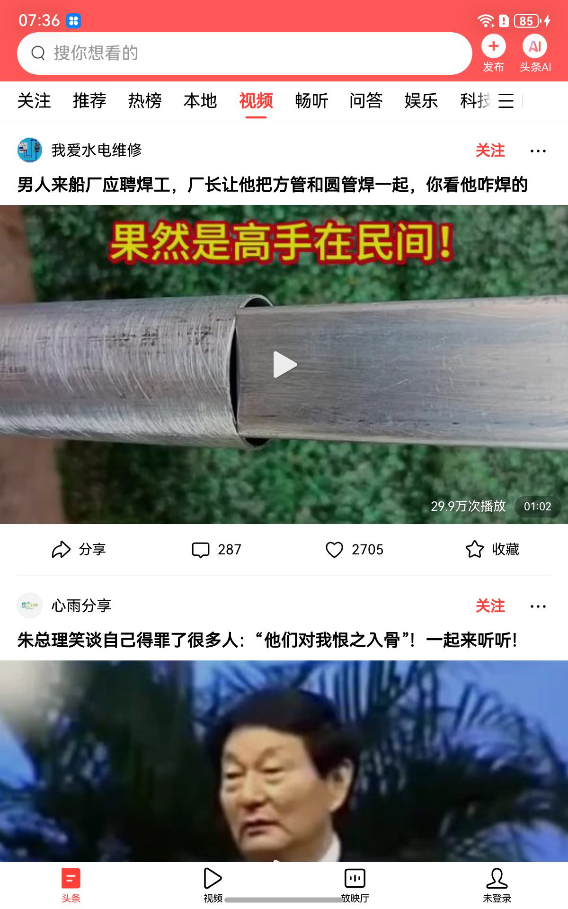

# OpenHarmony Android 双引擎兼容运行时复现基线

**今日头条 & 微信 8.0.77**

在 **OpenHarmony 6.1.0.31 / DAYU200 (aarch64)** 上，通过 Westlake **a2oh** Android 兼容适配层，把两款完整商业 Android 应用跑到可用首帧：

| 引擎 | 包名 | 验收态 |
|---|---|---|
| 今日头条 | `com.ss.android.article.news` | 推荐信息流 + 视频频道直播上屏、输入泵可点 |
| 微信 8.0.77 | `com.tencent.mm` | 蓝色地球欢迎页 +「登录 / 注册」完整 UI |

仓库：[BH3GEI/openharmony-toutiao-repro](https://github.com/BH3GEI/openharmony-toutiao-repro)

---

## 视觉验收（凭据）

### 今日头条 · 信息流 & 视频




### 微信 8.0.77 · 欢迎 / 登录


---

## 三分钟快速复现

```bash
git clone git@github.com:BH3GEI/openharmony-toutiao-repro.git
cd openharmony-toutiao-repro
./reproduce.sh all
```

| 命令 | 作用 |
|---|---|
| `./reproduce.sh check` | 检查 `hdc` / 板子序列号 / 本地产物 |
| `./reproduce.sh toutiao` | 部署共享运行时 + 启动头条 + 截图到 `frames/verified_toutiao_*.jpeg` |
| `./reproduce.sh wechat` | 部署共享运行时 + 启动微信欢迎页 + 截图 |
| `./reproduce.sh all` | 依次跑头条与微信 |

环境变量（可选）：

| 变量 | 默认 | 含义 |
|---|---|---|
| `HDC` | `./hdc-remote` 或系统 `hdc` | hdc 二进制 |
| `HDC_TARGET` / `PREFERRED_SERIAL` | `5ce1227d…23012c` | 板子序列号 |
| `WAIT_TOUTIAO_S` | `90` | 头条冷启动等待秒数 |
| `WAIT_WECHAT_S` | `25` | 微信欢迎页等待秒数 |

> 大体积 APK / so 走 GitHub Release：`scripts/fetch_prebuilts.sh`。  
> 微信 ~280MB APK 不入库；首次需按 [`docs/wechat/PROGRESS.md`](docs/wechat/PROGRESS.md) 完成板端 stub 安装。

板端基线：OpenHarmony **6.1.0.31**、`pr03-74e6-portable` 七路 bind mount `state=READY`。

---

## 越过的 19 层阻断（技术拆解）

两款应用共享同一条适配层主干；下列是从「装得上」到「画得出、点得动、拉得到」的关键层。编号便于对照排雷日志，不是严格的时间序。

| # | 层 | 根因 | 过法 |
|---|---|---|---|
| 1 | AccessToken / seccomp | appspawn 按 ATM 判 INTERNET，映射为空 → `socket` EPERM | 直写 `access_token.db` 授权行 |
| 2 | ColorMatrix 桩缺口 | `set([F)V` 缺失 → 信息流 inflate 失败 | App dex 中和夜间滤镜路径 |
| 3 | Conscrypt / Platform | okhttp 探测 `SSLParametersImpl` 全无 | Mira ClassLoader 注入空类 dex |
| 4 | ICU 版本错位 | tttext 按 OH `icudt74` dlsym，适配层是 72 | `libwlicu.so` 尾跳 + 改 dlopen 名 |
| 5 | fdsan / NPTH | bionic 形回调撞 musl `close` | 从 apk 删除 `libnpth.so` |
| 6 | 子窗口 EGL_NO_SURFACE | PopupWindow `session=1` 拆主窗 surface | **Dynamic Proxy AMS**：`sSubWindows` 注册表 + 释放 `mSurface` |
| 7 | Soft-draw 未 lock | 降级 `drawSoftware` 无 buffer producer | 同上，调用后失效 Surface |
| 8 | FFRT / 栈生长 | 深递归 / 小栈在 OH 上炸 | `libwestlake_stackgrow.so` |
| 9 | 栈金丝雀 TLS | bionic 库读 `__stack_chk_guard` 与 musl 槽不一致 → `__stack_chk_fail` | ELF UND 改名（如 WCDB→`getpid`）/ 弱化 |
| 10 | Musl `init_array` | bionic 尾部空哨兵，musl `do_init_fini` 调 NULL | `tools/wechat/sanitize_elf.py` 消毒 |
| 11 | SQLite / ashmem | CursorWindow / 连接 JNI 全缺 | `libwlsqlite.so` + 按包名 `curAppShim` |
| 12 | ALooper 桥 | 纯 Java TLS 需要 native looper 泵 | `libwlalooper.so` |
| 13 | TLS 空桩 | `construct-only SSLContext`，HTTPS 发不出 | BCJSSE / WLTLS / WLBC 纯 Java 栈 |
| 14 | 输入生产端缺失 | 适配层未订阅 MMI | `wl-input-pump` 文件泵 + topInputTarget |
| 15 | WebView 防崩 | provider / WebSettings 抽象类不可 Proxy | 守卫 provider + dex 中和预热路径 |
| 16 | meta-data 空 Bundle | BMS 不带 Android meta-data → NPE | `wl-metadata.properties` + `enrichMetaData` |
| 17 | 外存卷空数组 | `getExternalDirs()[0]` OOB | 占位 `InitialApplication` / VFS 旁路 |
| 18 | AMS 应用内 startActivity | OH 拒 Android 进程 `StartAbility`(2097205) | LaunchActivityItem **intent 重定向** |
| 19 | SplashHack 掉包 | `SplashHackInstrumentation.newActivity` 永远返回占位 Activity | 运行期 **unhook** 还原真 Instrumentation |

更深的窗口 / 输入 / TLS 目标态见架构蓝图；微信逐条排雷见进度文档。

---

## 文档地图

| 文档 | 内容 |
|---|---|
| [`docs/ARCHITECTURE_BLUEPRINT.md`](docs/ARCHITECTURE_BLUEPRINT.md) | 四课题顶层架构：窗口 SceneSession、MMI 穿透、TLS 底座、工业化合流 |
| [`docs/BASELINE_RELEASE.md`](docs/BASELINE_RELEASE.md) | S3 官方统一运行库标准基线出库记录（确定性 jar / 闸门） |
| [`docs/network/`](docs/network/) | S2 网络协议栈架构、交付、降级与收口 |
| [`docs/wechat/PROGRESS.md`](docs/wechat/PROGRESS.md) | 微信 8.0.77 全量排雷与欢迎页里程碑 |
| [`docs/INPUT_PATH_ANALYSIS.md`](docs/INPUT_PATH_ANALYSIS.md) | 头条输入链路断裂与泵方案 |
| [`docs/ROOT-CAUSES.md`](docs/ROOT-CAUSES.md) | 首帧阶段根因表 |

工具：

| 路径 | 作用 |
|---|---|
| `reproduce.sh` | 统一复现入口（本页快速开始） |
| `scripts/deploy_and_run.sh` | 头条细粒度部署（`--tls` / `--all`） |
| `tools/wechat/` | `sanitize_elf.py` · `elf_weaken.py` · `rebuild_apk.sh` · `wl-metadata.properties` |
| `frames/screens/` | 头条全界面验收画册 |
| `frames/wechat/` | 微信黄金帧 |

---

## 仓库结构（精简）

```
toutiao-repro/
├── reproduce.sh              ← 你从这里开始
├── prebuilts/                ← jar / so / apk（大文件走 Release）
├── amr/                      ← ActivityManagerRouting 源与构建
├── tls-bridge/               ← 纯 Java TLS 载荷
├── scripts/                  ← 部署、授权、输入矩阵
├── tools/wechat/             ← 微信 ELF / APK 工具链
├── frames/                   ← 验收截图（含 wechat/）
└── docs/                     ← 蓝图 · 基线 · 网络 · 微信进度
```

---

## 环境与边界（如实）

- **板子**：DAYU200 类 RK3568，aarch64；系统钉死 **6.1.0.31**（勿随意升级）。
- **运行时**：Westlake a2oh，`appspawn-x` ondemand + sealed child plugin。
- **解释器模式**：`APPSPAWNX_FORCE_INT=1`，冷启动慢但可复现；JIT 在本适配层不可用。
- **微信 APK**：不进 git；板端独立槽位 uid `20010058`，与头条 `20010057` 隔离。
- **仍开放的能力边界**：详情页 WebView 真渲染、子窗口可见可点的 SceneSession 拓扑、设备注册指纹等——见蓝图「技术债」与网络收口文档，**未在 UI 层做假修复**。

---

## 许可与贡献

复现脚本与文档以本仓库为准。提交前请跑：

```bash
./reproduce.sh check
```

问题与 PR 请开到 [BH3GEI/openharmony-toutiao-repro](https://github.com/BH3GEI/openharmony-toutiao-repro)。
