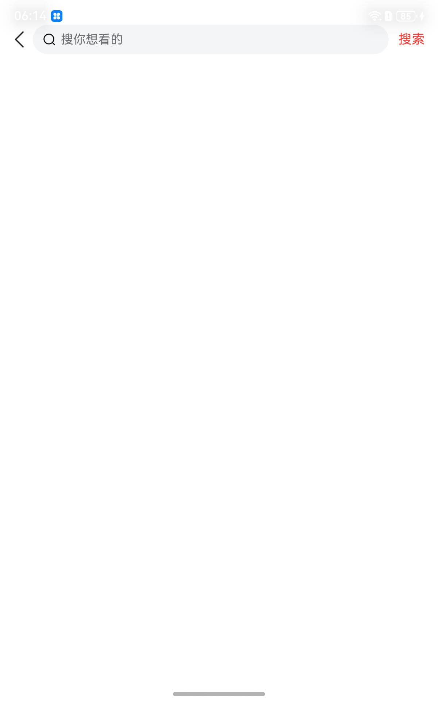
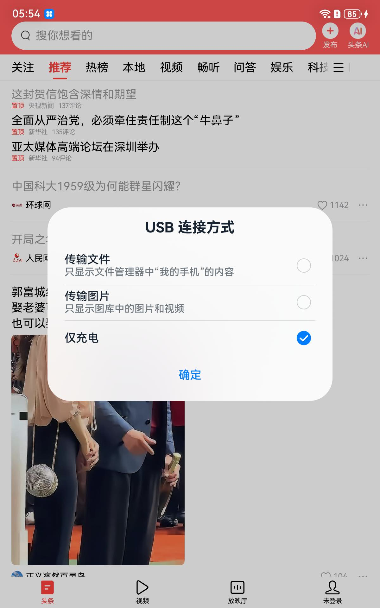

# 全界面验收矩阵

板端 DAYU200 / OpenHarmony 6.1.0.31，1200x1920，2026-09-06 实测。
运行组合：`base.final9.apk` + `oh-adapter-runtime.all.jar`（输入泵 + 窗口按秩选 +
VelocityTracker + Theme AXML 兜底 + WebView 防崩代理 + SQLite shim + TLS 网关）。

| # | 界面 | 采集方式 | 结果 | 截图 |
|---|---|---|---|---|
| 1 | 推荐信息流 | 冷启动 `aa start MainActivity` | ✅ 真实内容 |  |
| 2 | 视频频道 | `wl_input.sh tap 560 213` | ✅ 切换成功，进程存活 |  |
| 3 | 搜索主页 | `aa start com.android.bytedance.search.SearchActivity` | ✅ 上屏；下方内容区空 |  |
| 4 | 个人中心 | `wl_input.sh tap 1050 1870` | ❌ **未切换** |  |

## 逐条说明

**1 · 推荐信息流** — 158 KB。内容来自 `news_article.db` 缓存（该轮全进程仅少量 TLS 连接）。

**2 · 视频频道** — 93 KB。**此前 100% 打死进程**
（`InflateException … PullToRefreshSSWebView`），现在切换成功且 `alive=1`。
这是 WebView 防崩代理的直接效果。

**3 · 搜索主页** — 43 KB。这一格经历了三层修复才上屏：

1. `ActivityInfo.theme` 恒为 0 → `IllegalStateException: You need to use a
   Theme.AppCompat theme` → 进程死。修法：适配层内置 AXML 解析回填 theme。
2. `NoClassDefFoundError: X.BdA` → 进程死。`X.BdA.<clinit>` 调 `c()`，
   后者经 `X.3CD.a` 撞上 `ArrayIndexOutOfBoundsException(length=0)`；
   `<clinit>` 一失败该类被永久标记 erroneous。修法：dex 等宽替换，字段置 null。
3. 上屏后**顶栏渲染正常**（返回箭头、输入框、红色「搜索」），
   **下方搜索建议/热搜区仍为空** —— 那需要实时接口，而
   `api.toutiaoapi.com` 对本机一律返回 `400 invalid user`（无 `device_id`/`install_id`），
   属设备注册层，不是 UI 层。

**4 · 个人中心** — 逐像素与信息流一致，**未切换**。坐标经绝对矩形核对无误
（`MainTabIndicator abs=[900,1821][1200,1920]`），事件确实送达主窗口且无异常。
点击会触发到 `api.toutiaoapi.com` 的真实 HTTPS 请求，但 Tab 不切换——
与第 3 格下半部分同源，都指向设备身份未注册。**如实记录为未通过。**

> 采集提示：冷启动 50–80 s 后进程自行消失与内存强相关（重启后 5.0 GB 空闲时稳定，
> 连跑数轮掉到 ~1.0 GB 即开始失败）。**采集前重启板子。**
> 另：hdc 连接会弹出系统「USB 连接方式」对话框盖住画面，
> 用 `uinput -T -c 600 1185` 点掉「确定」后再截图。

## 附：详情页为什么不在矩阵里

详情页（`DyNewDetailActivity`）的**崩溃已经全部消除**，但仍拿不到画面。三层依次剥开：

| 层 | 现象 | 处理 |
|---|---|---|
| 1 | `createWebView` NPE → `InflateException` → 进程死 | WebView 防崩代理（惰性 provider）|
| 2 | `WebSettings.getUserAgentString()` on null，出自 `preCreateWebView` | dex 中和 `preCreateWebView`（classes21）|
| 3 | `FileNotFoundException: emoticon/emoticon.conf` 出自 `initEmojiIconLayout`，被 Mira 吞掉导致 `setContentView` 未完成 | dex 中和 `initEmojiIconLayout`（classes6）。该 asset **apk 里根本没有**（466 个 assets 零命中），真机上由插件下发 |

三刀之后：**进程全程 `alive=1`、日志无任何异常**，但 `addToDisplay` 计数仍为 0。
最可能的原因是 `aa start` 没有携带文章 ID，详情 Activity 没有可展示的内容而自行
`finish()` —— 这在真机上不会发生，因为详情页总是从信息流条目点进去的。

而**从信息流点进去这条路也不通**：控件树显示条目根与标题都不是 clickable

```
FeedItemRootLinerLayout  y=531..698 / 699..866 / 867..1871   clk=False
FeedTitleTextView        y=272..322 / 438..488               clk=False
```

只有头像、来源名、「…」菜单挂了监听器。合成点击落点再准也不会导航。

**结论：详情页的闪退已修完，但"能显示"还差一个入口——要么给 `aa start` 补上
文章 ID 参数，要么查清头条信息流条目的点击是怎么绑定的。如实记录为未取得。**
